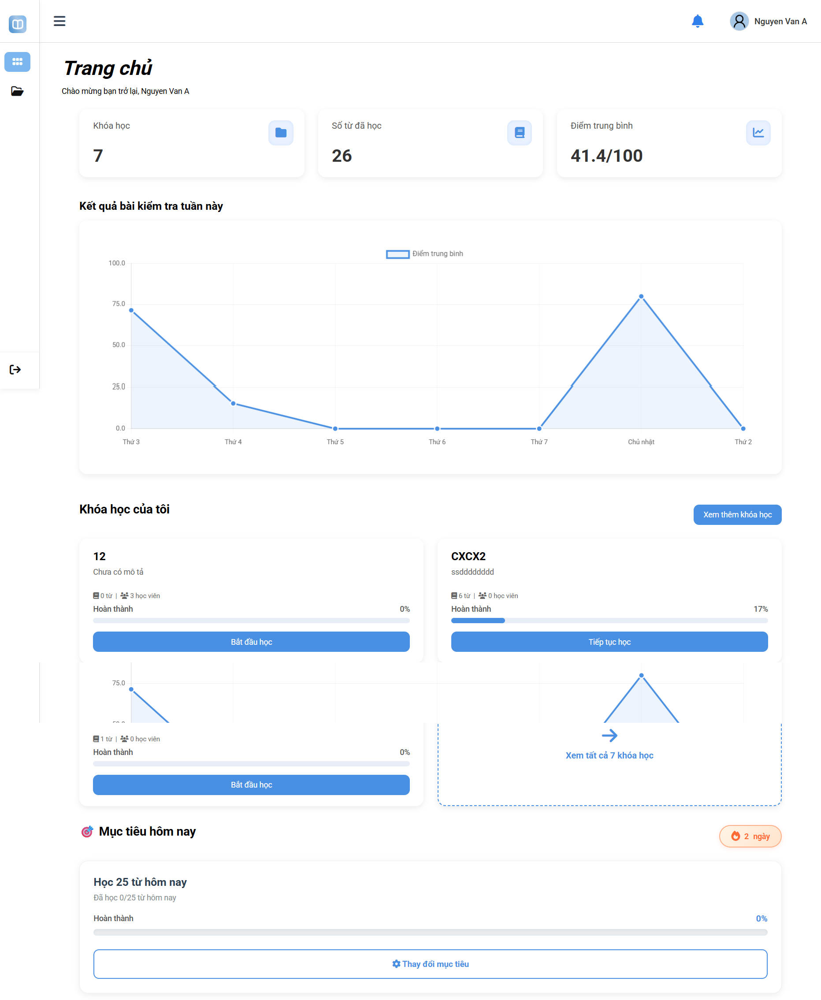
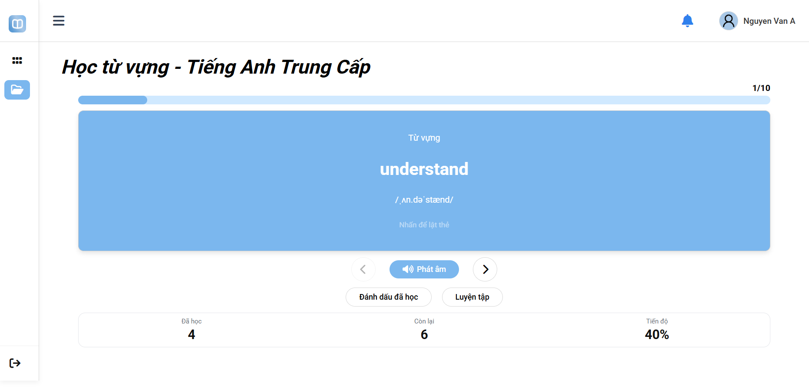
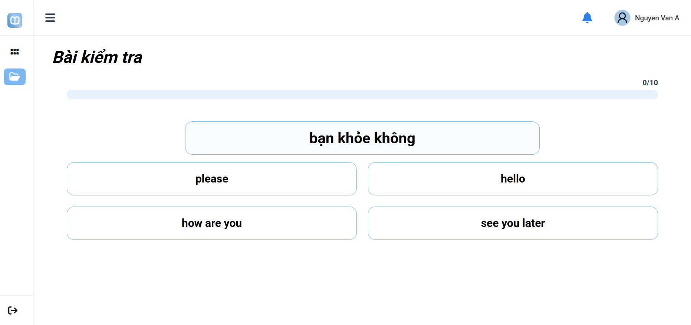
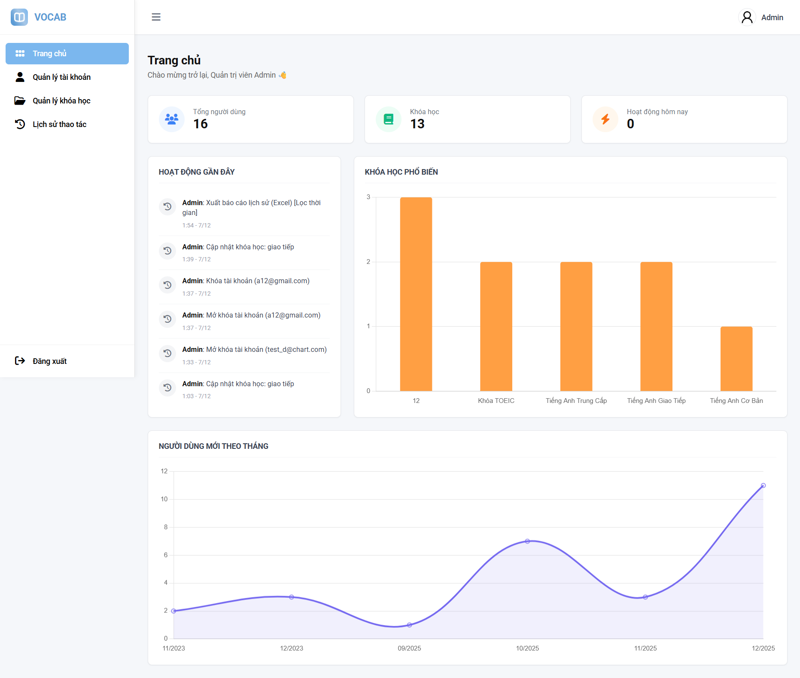

# 📚 VOCAB - Hệ Thống Học Từ Vựng Tiếng Anh Thông Minh

> **Ứng dụng web học từ vựng tiếng Anh với các tính năng hiện đại: Flashcard, Quiz trắc nghiệm, Điền từ, Theo dõi tiến độ, Streak motivational, Cross-tab sync và nhiều hơn nữa!**


---

## 📖 Mục lục

- [Giới thiệu](#-giới-thiệu)
- [Tính năng chính](#-tính-năng-chính)
- [Công nghệ sử dụng](#-công-nghệ-sử-dụng)
- [Cấu trúc thư mục](#-cấu-trúc-thư-mục)
- [Cài đặt](#-cài-đặt)
- [Hướng dẫn sử dụng](#-hướng-dẫn-sử-dụng)
- [API Documentation](#-api-documentation)
- [Screenshots](#-screenshots)
- [Đóng góp](#-đóng-góp)

---

## 🎯 Giới thiệu

**VOCAB** là một hệ thống học từ vựng tiếng Anh toàn diện được phát triển bằng PHP, MySQL và JavaScript. Ứng dụng cung cấp trải nghiệm học tập cá nhân hóa với nhiều phương pháp học khác nhau, theo dõi tiến độ chi tiết và hệ thống gamification để tăng động lực học tập.

### 🎓 Dành cho ai?

- **Học sinh, sinh viên** muốn cải thiện vốn từ vựng tiếng Anh
- **Người đi làm** cần nâng cao trình độ tiếng Anh chuyên ngành
- **Giáo viên** muốn tạo và quản lý khóa học cho học viên
- **Cộng đồng học tập** chia sẻ và tham gia các khóa học công khai

---

## ✨ Tính năng chính

### 👤 Dành cho Người dùng

#### 🎓 Học tập & Ôn tập
- **3 chế độ học từ vựng:**
  - 📇 **Flashcard**: Học từ theo thẻ ghi nhớ với hiệu ứng lật thẻ
  - ✅ **Trắc nghiệm**: Kiểm tra với 4 phương án lựa chọn
  - ✏️ **Điền từ**: Nhập đáp án, phát triển khả năng viết

- **Hệ thống phát âm:**
  - Nghe phát âm chuẩn IPA
  - Upload file audio tùy chỉnh
  - Hiển thị phiên âm quốc tế

#### 📊 Theo dõi tiến độ
- **Dashboard thống kê:**
  - Tổng số từ đã học
  - Điểm trung bình các bài kiểm tra
  - Biểu đồ kết quả tuần này
  - Streak days (số ngày học liên tục) 🔥

- **Mục tiêu hàng ngày:**
  - Đặt số từ mới cần học mỗi ngày
  - Thanh tiến độ trực quan
  - Thông báo hoàn thành mục tiêu

#### 📚 Quản lý khóa học
- Tạo khóa học riêng tư hoặc công khai
- Tham gia khóa học từ cộng đồng
- Tìm kiếm khóa học theo tags
- Xem chi tiết từng khóa học (số từ, học viên, tiến độ)
- Import/Export từ vựng

#### 🔔 Thông báo thông minh
- Thông báo hoàn thành quiz
- Nhắc nhở ôn tập từ cũ
- Cảnh báo mất streak
- Thông báo đạt milestone

### 👨‍💼 Dành cho Admin

- **Quản lý người dùng:**
  - Xem danh sách user
  - Khóa/Mở tài khoản
  - Cập nhật thông tin user

- **Quản lý khóa học:**
  - Duyệt khóa học công khai
  - Chỉnh sửa nội dung khóa học
  - Xóa khóa học vi phạm
  - Xem thống kê khóa học

- **Lịch sử hoạt động:**
  - Log mọi thao tác admin
  - Export log theo ngày
  - Theo dõi IP và User Agent

- **Dashboard Analytics:**
  - Tổng người dùng
  - Tổng khóa học
  - Hoạt động hôm nay
  - Biểu đồ người dùng mới theo tháng

### 🔒 Bảo mật & Hiệu năng

- **Xác thực đa nền tảng:**
  - Đăng ký/Đăng nhập bằng Email + Password
  - OAuth 2.0: Google Login
  - OAuth 2.0: Facebook Login
  - Xác thực email qua mã OTP

- **Bảo vệ API:**
  - Rate Limiting (60 requests/minute)
  - CSRF Token protection
  - SQL Injection prevention (Prepared Statements)
  - XSS protection (htmlspecialchars)
  - Password hashing (bcrypt)

- **Cross-tab Synchronization:**
  - Đồng bộ dữ liệu real-time giữa các tab
  - Không cần F5 khi có thay đổi
  - Sử dụng BroadcastChannel API

---

## 🛠 Công nghệ sử dụng

### Backend
- **PHP 7.4+** - Server-side scripting
- **MySQL 8.0+** - Relational database
- **MySQLi & PDO** - Database drivers
- **Apache 2.4** - Web server (XAMPP)

### Frontend
- **HTML5 & CSS3** - Semantic markup & modern styling
- **JavaScript ES6+** - Vanilla JS, no frameworks
- **Chart.js** - Data visualization
- **Font Awesome 6.5** - Icons
- **Google Fonts** - Typography (Roboto)

### APIs & Libraries
- **Google OAuth 2.0** - Google Sign-In
- **Facebook Graph API** - Facebook Login
- **BroadcastChannel API** - Cross-tab sync
- **Fetch API** - AJAX requests

### Development Tools
- **XAMPP** - Local development environment
- **Git** - Version control
- **VS Code** - Code editor

---

## 📁 Cấu trúc thư mục

```
VOCAB/
│
├── 📂 api/                          # REST API Endpoints
│   ├── get-words.php                # Lấy danh sách từ vựng
│   ├── get-my-courses.php           # Lấy khóa học của user
│   ├── save-quiz-result.php         # Lưu kết quả quiz
│   ├── get-dashboard-stats.php      # Thống kê dashboard
│   ├── get-daily-goal.php           # Mục tiêu hàng ngày + streak
│   ├── update-learned-word.php      # Cập nhật trạng thái từ
│   ├── 📂 admin/                    # API dành cho admin
│   │   ├── dashboard_get_stats.php  # Thống kê admin
│   │   ├── user_get_list.php        # Danh sách user
│   │   ├── course_get_list.php      # Danh sách khóa học
│   │   └── log_get_list.php         # Lịch sử hoạt động
│   └── 📂 common/                   # API chung
│       ├── get_csrf.php             # Lấy CSRF token
│       └── rate_limit_middleware.php# Rate limiting
│
├── 📂 assets/                       # Static resources
│   ├── 📂 css/                      # Stylesheets
│   │   ├── defaut/                  # CSS chung (header, menu, body)
│   │   ├── user/                    # CSS cho user pages
│   │   └── admin/                   # CSS cho admin pages
│   ├── 📂 js/                       # JavaScript
│   │   ├── defaut/                  # JS chung (auth, sync)
│   │   ├── user/                    # JS cho user features
│   │   └── admin/                   # JS cho admin features
│   ├── 📂 images/                   # Hình ảnh, avatars
│   └── 📂 fonts/                    # Font Awesome
│
├── 📂 auth/                         # Xác thực người dùng
│   ├── login.php                    # Form đăng nhập
│   ├── register.php                 # Form đăng ký
│   ├── logout.php                   # Đăng xuất
│   ├── verify-email.php             # Xác thực email
│   ├── google-login.php             # Redirect Google OAuth
│   ├── google-callback.php          # Callback Google OAuth
│   ├── facebook-login.php           # Redirect Facebook OAuth
│   └── facebook-callback.php        # Callback Facebook OAuth
│
├── 📂 config/                       # ⭐ Cấu hình hệ thống
│   ├── config.php                   # Cấu hình chung (timezone, paths)
│   ├── database.php                 # Kết nối MySQL
│   ├── constants.php                # Hằng số (roles, status, levels)
│   ├── oauth.php                    # Cấu hình OAuth (Google, Facebook)
│   └── streak_helper.php            # Logic tính streak days
│
├── 📂 includes/                     # Thư viện hàm dùng chung
│   ├── functions.php                # 20+ hàm tiện ích
│   ├── auth_check.php               # Middleware kiểm tra đăng nhập
│   ├── notification_helper.php      # Tạo thông báo tự động
│   ├── log_helper.php               # Ghi log hoạt động admin
│   ├── rate_limiter.php             # Rate limiting protection
│   ├── header_*.html                # Header cho từng layout
│   ├── menu_*.html                  # Menu cho từng role
│   └── footer.html                  # Footer chung
│
├── 📂 pages/                        # Giao diện người dùng
│   ├── 📂 admin/                    # Trang quản trị
│   │   ├── trangchu_admin.html      # Dashboard admin
│   │   ├── quanlytaikhoan.html      # Quản lý user
│   │   ├── quanlykhoahoc.html       # Quản lý khóa học
│   │   └── lichsuthaotac.html       # Lịch sử hoạt động
│   └── 📂 user/                     # Trang người dùng
│       ├── user_Dashboard.html      # Dashboard user
│       ├── khoa_hoc_cua_toi.html    # Khóa học của tôi
│       ├── khoa_hoc_cong_dong.html  # Khóa học cộng đồng
│       ├── chi_tiet_khoa_hoc.html   # Chi tiết khóa học
│       ├── user_hoc_tu_vung.html    # Học từ vựng
│       ├── user_kiem_tra.html       # Làm bài kiểm tra
│       ├── user_ontap_*.html        # Các chế độ ôn tập
│       └── ho_so_user.html          # Hồ sơ cá nhân
│
├── 📂 process/                      # Backend logic
│   ├── login-process.php            # Xử lý đăng nhập
│   ├── register-process.php         # Xử lý đăng ký
│   └── verify-email-process.php     # Xử lý xác thực email
│
├── 📂 uploads/                      # ⚠️ Upload directory (cần quyền ghi)
│   ├── documents/                   # Tài liệu
│   └── temp/                        # File tạm
│
├── 📂 logs/                         # ⚠️ System logs (auto-generated)
│
├── 📄 index.html                    # ⭐ Landing page
├── 📄 .env                          # ⚠️ Biến môi trường (KHÔNG commit)
├── 📄 .htaccess                     # Apache config
├── 📄 README.md                     # ⭐ File này
└── 📄 SYNC_DOCUMENTATION.md         # Tài liệu về cross-tab sync

```

### 🔑 Các file quan trọng

| File | Mô tả |
|------|-------|
| `config/database.php` | Kết nối MySQL (MySQLi + PDO) |
| `config/constants.php` | Định nghĩa hằng số: roles, status, word levels |
| `includes/functions.php` | Thư viện 20+ hàm: validation, security, helpers |
| `includes/auth_check.php` | Middleware kiểm tra đăng nhập |
| `includes/rate_limiter.php` | Bảo vệ khỏi spam/abuse |
| `api/get-session-user.php` | Lấy thông tin user đang đăng nhập |
| `SYNC_DOCUMENTATION.md` | Hướng dẫn sử dụng cross-tab sync |

---

## 🚀 Cài đặt

### 📋 Yêu cầu hệ thống

- **XAMPP** (hoặc LAMP/WAMP)
  - PHP 7.4 trở lên
  - MySQL 8.0 trở lên
  - Apache 2.4
- **Web Browser** hiện đại (Chrome, Firefox, Edge)
- **Git** (optional, để clone project)

### 📥 Bước 1: Tải về project

**Cách 1: Clone từ Git**
```bash
cd C:\xampp\htdocs
git clone https://github.com/yourusername/VOCAB.git
```

**Cách 2: Tải ZIP**
- Download ZIP từ GitHub
- Giải nén vào `C:\xampp\htdocs\VOCAB`

### 🗄️ Bước 2: Tạo database

1. Mở **phpMyAdmin**: `http://localhost/phpmyadmin`
2. Tạo database mới tên `english_learning`
3. Import file SQL:
   - Click vào database `english_learning`
   - Chọn tab **Import**
   - Chọn file `database/english_learning.sql` (nếu có)
   - Click **Go**

**Hoặc chạy SQL sau:**
```sql
CREATE DATABASE english_learning CHARACTER SET utf8mb4 COLLATE utf8mb4_unicode_ci;
USE english_learning;

-- Sau đó import các table từ file SQL
```

### ⚙️ Bước 3: Cấu hình

#### 3.1. Cấu hình Database

Mở file `config/database.php`, kiểm tra thông tin:

```php
define('DB_HOST', 'localhost');
define('DB_USER', 'root');
define('DB_PASS', '');              // XAMPP mặc định để trống
define('DB_NAME', 'english_learning');
```

#### 3.2. Cấu hình OAuth (Optional)

Tạo file `.env` từ `.env.example`:

```bash
cp .env.example .env
```

Cập nhật thông tin OAuth trong `.env`:

```env
# Google OAuth
GOOGLE_CLIENT_ID=your_google_client_id
GOOGLE_CLIENT_SECRET=your_google_client_secret
GOOGLE_REDIRECT_URI=http://localhost/VOCAB/auth/google-callback.php

# Facebook OAuth
FACEBOOK_APP_ID=your_facebook_app_id
FACEBOOK_APP_SECRET=your_facebook_app_secret
FACEBOOK_REDIRECT_URI=http://localhost/VOCAB/auth/facebook-callback.php
```

> **Lưu ý**: Nếu không dùng OAuth, bạn vẫn có thể đăng nhập bằng Email/Password bình thường.

#### 3.3. Phân quyền thư mục

Đảm bảo các thư mục sau có quyền ghi:

```
uploads/
logs/
```

**Windows (XAMPP)**: Mặc định đã có quyền

**Linux/Mac**:
```bash
chmod 777 uploads/ -R
chmod 777 logs/ -R
```

### 🎬 Bước 4: Chạy ứng dụng

1. Khởi động **XAMPP Control Panel**
2. Start **Apache** và **MySQL**
3. Truy cập: `http://localhost/VOCAB`

### 👤 Tài khoản mẫu

Sau khi import database, bạn có thể dùng:

**Admin:**
- Email: `admin@vocab.com`
- Password: `Admin@123`

**User:**
- Email: `user@vocab.com`
- Password: `User@123`

> **Lưu ý**: Nên đổi password sau lần đăng nhập đầu tiên!

---

## 📖 Hướng dẫn sử dụng

### Dành cho Người dùng

#### 1️⃣ Đăng ký tài khoản

1. Truy cập trang chủ: `http://localhost/VOCAB`
2. Click **Đăng ký ngay**
3. Điền thông tin: Email, Password, Tên
4. Xác thực email bằng mã OTP được gửi về

**Hoặc đăng nhập nhanh bằng:**
- 🔵 Google Account
- 🟦 Facebook Account

#### 2️⃣ Tạo khóa học mới

1. Vào **Khóa học của tôi** → Click **Tạo khóa học**
2. Điền thông tin:
   - Tên khóa học
   - Mô tả
   - Chế độ: Công khai / Riêng tư
   - Tags (để dễ tìm kiếm)
3. Click **Tạo khóa học**
4. Thêm từ vựng vào khóa học

#### 3️⃣ Thêm từ vựng

1. Vào **Chi tiết khóa học** → **Thêm từ vựng**
2. Nhập thông tin:
   - Từ tiếng Anh
   - Nghĩa tiếng Việt
   - Định nghĩa (optional)
   - Phiên âm IPA (optional)
   - Upload file audio (optional)
   - Từ loại (Noun, Verb, Adjective...)
3. Click **Lưu từ**

**Thêm nhanh nhiều từ:**
- Import từ file Excel/CSV
- Copy-paste từ danh sách có sẵn

#### 4️⃣ Học từ vựng

**Chế độ Flashcard:**
1. Chọn khóa học → **Học từ vựng**
2. Xem từ tiếng Anh → Đoán nghĩa
3. Click thẻ để lật → Xem đáp án
4. Đánh dấu **Biết** hoặc **Chưa biết**

**Chế độ Trắc nghiệm:**
1. Chọn **Ôn tập** → **Trắc nghiệm**
2. Chọn 1 trong 4 đáp án
3. Xem kết quả ngay lập tức
4. Hoàn thành để lưu điểm

**Chế độ Điền từ:**
1. Chọn **Ôn tập** → **Điền từ**
2. Nhập đáp án vào ô trống
3. Hệ thống tự chấm điểm
4. Xem đáp án đúng nếu sai

#### 5️⃣ Theo dõi tiến độ

**Dashboard:**
- Xem tổng số từ đã học
- Điểm trung bình các bài kiểm tra
- Biểu đồ kết quả tuần này
- Streak days 🔥

**Đặt mục tiêu hàng ngày:**
1. Vào **Dashboard** → **Mục tiêu hôm nay**
2. Kéo thanh trượt chọn số từ (5-50 từ/ngày)
3. Click **Lưu mục tiêu**
4. Học đủ số từ để hoàn thành ✅

**Streak Motivation:**
- Học mỗi ngày để tăng streak 🔥
- Không học sẽ mất streak về 0
- Streak càng cao, động lực càng lớn!

#### 6️⃣ Tham gia khóa học cộng đồng

1. Vào **Khóa học cộng đồng**
2. Tìm kiếm theo tên hoặc tags
3. Xem chi tiết khóa học
4. Click **Tham gia** để học

### Dành cho Admin

#### 🔧 Quản lý người dùng

1. Vào **Quản lý tài khoản**
2. Xem danh sách user:
   - Tên, Email, Role
   - Ngày đăng ký
   - Trạng thái (Active/Inactive)
3. **Khóa tài khoản**: Click icon 🔒
4. **Cập nhật thông tin**: Click icon ✏️
5. **Xem chi tiết**: Click tên user

#### 📚 Quản lý khóa học

1. Vào **Quản lý khóa học**
2. Xem tất cả khóa học:
   - Công khai / Riêng tư
   - Số từ, số học viên
   - Người tạo
3. **Duyệt khóa học**: Phê duyệt khóa học công khai
4. **Chỉnh sửa**: Sửa nội dung khóa học
5. **Ẩn/Xóa**: Ẩn hoặc xóa khóa học vi phạm

#### 📊 Xem thống kê

**Dashboard Admin:**
- Tổng người dùng
- Tổng khóa học
- Hoạt động hôm nay
- Biểu đồ người dùng mới theo tháng
- Khóa học phổ biến

#### 📜 Lịch sử hoạt động

1. Vào **Lịch sử thao tác**
2. Xem log mọi hành động admin:
   - Thời gian
   - Admin thực hiện
   - Hành động
   - IP Address
   - User Agent
3. **Export log**: Click **Xuất Excel**

---

## 📡 API Documentation

### 🔐 Authentication

Hầu hết API yêu cầu user đã đăng nhập. Session được kiểm tra tự động.

### 📌 Base URL

```
http://localhost/VOCAB/api/
```

### 🔑 Common Headers

```http
Content-Type: application/json
```

### 📚 API Endpoints

#### User APIs

**1. Get Session User**
```http
GET /api/get-session-user.php
```

Response:
```json
{
  "success": true,
  "user_id": 1,
  "name": "John Doe",
  "email": "john@example.com",
  "role": "user",
  "avatar": "avatar.jpg"
}
```

---

**2. Get My Courses**
```http
GET /api/get-my-courses.php?user_id=1
```

Response:
```json
{
  "success": true,
  "data": [
    {
      "id": 1,
      "tieuDe": "TOEIC 600+",
      "mota": "Khóa học từ vựng TOEIC",
      "soTu": 500,
      "tienDo": 45,
      "trangThai": "Đang học",
      "isOwner": true
    }
  ]
}
```

---

**3. Get Words**
```http
GET /api/get-words.php?course_id=1&user_id=1
```

Response:
```json
{
  "success": true,
  "data": {
    "course_id": 1,
    "course_name": "TOEIC 600+",
    "words": [
      {
        "word_id": 1,
        "word": "abandon",
        "meaning": "từ bỏ",
        "ipa": "/əˈbændən/",
        "audio": "abandon.mp3",
        "learned": true,
        "status": "mastered"
      }
    ],
    "statistics": {
      "total": 500,
      "learned": 225,
      "remaining": 275,
      "progress": 45
    }
  }
}
```

---

**4. Save Quiz Result**
```http
POST /api/save-quiz-result.php
Content-Type: application/json
```

Body:
```json
{
  "course_id": 1,
  "total_questions": 20,
  "correct_count": 18,
  "incorrect_count": 2,
  "score": 90,
  "duration_seconds": 300,
  "details": [
    {
      "word_id": 1,
      "user_answer": "từ bỏ",
      "correct_answer": "từ bỏ",
      "is_correct": true,
      "response_time": 5
    }
  ]
}
```

Response:
```json
{
  "success": true,
  "message": "Lưu kết quả thành công",
  "session_id": 123
}
```

---

**5. Get Daily Goal**
```http
GET /api/get-daily-goal.php?user_id=1
```

Response:
```json
{
  "success": true,
  "data": {
    "daily_goal": 20,
    "learned_today": 15,
    "progress": 75,
    "streak_days": 7,
    "is_completed": false
  }
}
```

---

**6. Update Learned Word**
```http
POST /api/update-learned-word.php
Content-Type: application/json
```

Body:
```json
{
  "word_id": 1,
  "status": "mastered"
}
```

Response:
```json
{
  "success": true,
  "message": "Cập nhật thành công"
}
```

---

#### Admin APIs

**1. Dashboard Stats**
```http
GET /api/admin/dashboard_get_stats.php
```

Response:
```json
{
  "success": true,
  "data": {
    "total_users": 1250,
    "total_courses": 450,
    "today_activity": 89,
    "new_users_monthly": [120, 135, 150, 160]
  }
}
```

---

**2. Get User List**
```http
GET /api/admin/user_get_list.php?page=1&limit=20
```

Response:
```json
{
  "success": true,
  "data": {
    "users": [
      {
        "user_id": 1,
        "name": "John Doe",
        "email": "john@example.com",
        "role": "user",
        "status": 1,
        "created_at": "2024-01-15"
      }
    ],
    "total": 1250,
    "page": 1,
    "pages": 63
  }
}
```

---

**3. Export Logs**
```http
GET /api/admin/log_export.php?start_date=2024-01-01&end_date=2024-12-31
```

Response: Excel file download

---

### ⚠️ Error Responses

```json
{
  "success": false,
  "error": "User not logged in"
}
```

```json
{
  "success": false,
  "error": "Rate limit exceeded"
}
```

---

## 📸 Screenshots

### 📊 Dashboard User
Trang tổng quan với thống kê học tập, biểu đồ tiến độ và mục tiêu hàng ngày.



---

### 📇 Học từ vựng - Flashcard
Học từ vựng với thẻ ghi nhớ, lật thẻ để xem nghĩa và phát âm.



---

### ✅ Quiz - Trắc nghiệm
Kiểm tra kiến thức với các câu hỏi trắc nghiệm 4 đáp án.



---

### 👨‍💼 Admin Dashboard
Trang quản trị với thống kê hệ thống, quản lý user và khóa học.



---

## 🤝 Đóng góp

Mọi đóng góp đều được hoan nghênh! Để đóng góp:

1. **Fork** project này
2. Tạo **branch** mới: `git checkout -b feature/AmazingFeature`
3. **Commit** thay đổi: `git commit -m 'Add some AmazingFeature'`
4. **Push** lên branch: `git push origin feature/AmazingFeature`
5. Tạo **Pull Request**

### 📝 Coding Standards

- **PHP**: PSR-12 coding standard
- **JavaScript**: ES6+ với semicolons
- **CSS**: BEM naming convention
- **Database**: Snake_case cho tên bảng và cột
- **Comments**: Tiếng Việt cho dễ hiểu

### 🐛 Báo lỗi

Nếu phát hiện lỗi, vui lòng tạo [Issue](https://github.com/yourusername/VOCAB/issues) với:

- Mô tả lỗi
- Các bước tái hiện
- Screenshots (nếu có)
- Môi trường: OS, PHP version, Browser

---

## 📄 License

Project này được phát hành dưới giấy phép **MIT License**.

Bạn được tự do:
- ✅ Sử dụng cho mục đích cá nhân
- ✅ Sử dụng cho mục đích thương mại
- ✅ Chỉnh sửa và phân phối lại
- ✅ Đóng góp cho project

---

---

## 🙏 Lời cảm ơn

- [Font Awesome](https://fontawesome.com/) - Icons
- [Chart.js](https://www.chartjs.org/) - Data visualization
- [Google Fonts](https://fonts.google.com/) - Typography
- [XAMPP](https://www.apachefriends.org/) - Development environment

---

